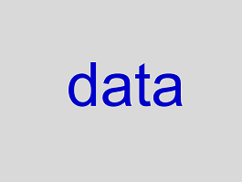

# Ten Simple Rules for Thinking Like a Programmer

[Greg Wilson](http://third-bit.com)

## Abstract

We describe ten ways programmers view the world that are often useful in
other contexts.

## Author Summary

Experienced programmers tend to think about problems in ways inspired by
their experience of programming. Understanding those ways of seeing the
world can help people in other domains see their own fields with fresh
eyes.

## Introduction

The term "computational thinking" has been widely used since [@Wing2006]
introduced it more than a decade ago, but there is little consensus on
what it actually means. Experienced programmers do, however, tend to
think about problems in ways inspired by their experience of
programming. Understanding those ways of seeing the world can help
people in other domains see their own fields with fresh eyes.

### Acknowledgments

An early version of this paper was inspired by Jon Udell's essay "Seven
Ways to Think Like the Web" [@Udel2011].

## 1. Programs are data.

The key insight that all of modern computing is built on is that
programs are just another kind of data. Source code is text, no
different from a thesis or a poem; it can be searched with the same
tools used to search other kinds of documents, and new text (such as
documentation) can be created from old.

More importantly, once a program is loaded into memory, the instructions
are just more bytes, and can be stored in data structures, passed
around, or altered. Almost all advanced programming techniques depend on
this fact in one way or another, from function pointers in C and
callbacks in JavaScript to decorators in Python and lazy evaluation in
R.

## 2. Computers don't understand anything.

Computers don't understand: they only obey instructions that make them
appear to. If you look at this image, you see the word "data":

A machine doesn't; it doesn't even see four blobs of blue pixels on a
gray background, because it doesn't "see" anything. The computer stores
this image, and a program, as bits in memory. If those bits happen to
correspond to instructions for the computer's CPU, and if those
instructions happen to make up a program for detecting shapes in images
and matching those shapes with letters in the alphabet, then the
computer may very well output "data", but *it doesn't understand*.
Calling a variable "temperature" doesn't mean the computer will store a
temperature in it---it would do exactly the same thing if the variable was
called "pressure" or "frankenstein" or "a7". Again, this may seem
obvious, but thirty years after Pea first called it the "superbug",
believing that the computer will somehow understand intent remains a
common error [@Pea1986].

## 3. Programming is about creating and combining abstractions.

Computers don't have to understand instructions in order to execute
them, but we need to understand them in order to create them (and fix
them afterward). Our brains can only keep track of a handful of things
at once [@Mill1956], we have to decompose complexity into chunks, then
think in terms of those chunks. The computing version of Dobzhansky's
famous dictum that nothing in biology makes sense except in light of
evolution [@Dobz1973] is therefore, "Nothing in software development
makes sense except in light of human psychology."

One key to making abstraction work is to separate *interface* and
*implementation*. An interface is what something knows how to do: the
questions it can answer, or the operations it can carry out. Its
implementation is how it does those things: what data it stores, what
algorithms it uses, and so on. There can be dozens of ways to implement
a particular interface; if we do our work well, we shouldn't have to
care about the implementation until something goes wrong or we need to
improve its performance. "Spare me the details" may be rude in real
life, but it's essential in programming.

The downside of creating abstractions is that they can lead to expert
blind spot [@Nath2003]. Once they have internalized patterns, experts
are often unable to remember that they ever saw the world any other way,
or to see the world afresh through novice eyes. As a result, they are
prone to say, "It's obvious," and then follow it with incomprehensible
jargon.

## 4. Every redundancy in software is an abstraction trying to be born.

The history of programming is in large part the history of people
noticing patterns and then making it easier for programmers to work with
them. Does your program repeatedly search an array to find the largest
and smallest values? Write a function called `bounds`. Does it
repeatedly search arbitrary data structures to find values that meet
certain criteria? Write a generator that returns values one by one and
another function that filters those according to some criteria.

This process is not neutral. As the saying goes, the tool shapes the
hand: every time we make some things easier we make other things
relatively harder, so every abstraction we support guides people away
from doing things in other ways.

## 5. Explicit is good for computers, implicit is good for humans.

One implication of our need for abstractions is important enough to be
its own rule: we should make things explicit for computers, but leave
room for inference for people. In jargon terms, this means creating
models for computers and views for human beings.

A *model* is a representation of something that is easy for a computer
to operate on; a *view* is a way of displaying it that human beings can
understand. For example, an HTML page consists of elements that have
attributes and that contain other elements or blocks of text:

That model can be rendered in a browser, turned into speech for someone
who is visually impaired, or displayed as text using angle brackets,
quotes, and some indentation. None of these *is* the model: they're all
views that make the model's content accessible to human beings in
different contexts. The model itself isn't just easier for the computer
to work with: it's essential, since as we said before, the computer
can't "see" the views that we create for human beings.

Turning a view back into a model is hard: parsing the textual
representation of HTML takes thousands of lines of code, and doing OCR
or speech recognition to translate the rendered page or its spoken
equivalent can take millions. The tags and attributes in the textual
representation of an HTML page are there because without it, the
computer can't tell whether something is in italics because it's being
emphasized or because it's the title of a book. To borrow an example
from Jon Udell, a PDF with a cartoon whose caption says, "The knitting
circle meets on the second Tuesday of every month" is a lot easier for
human beings to understand than a calendar entry in iCal format, but the
second is much easier for the computer.

## 6. Paranoia makes us productive.

Even simple software can go wrong in a bewildering variety of ways.
Since fixing something after it breaks takes more time than getting it
right in the first place, experienced programmers have learned the value
of investing time up front in figuring out exactly what they're trying
to accomplish, and in ensuring that what they've built meets those
requirements. "I want to count the stars in this photograph" is easy to
say, but what does it actually mean? What constitutes a star? When do
you decide that a lumpy blob of pixels is two stars rather than one, or
three instead of two? Every program embodies decisions about questions
like these, even if you don't realize that there was a question and that
you made a choice.

The sooner these decisions are made explicit and the earlier they're
checked, the less time is wasted. Recent research shows that
fine-grained development---i.e., interleaving short bursts of coding and
testing---is more effective than working in larger chunks [@Fucc2017],
since the objectives and implementation of the code are fresh in the
programmer's mind while testing.

Of course, we don't stop worrying once we've typed our code in. We check
that data is formatted properly to protect ourselves against "garbage
in, garbage out". We put checks in our code to make sure that parameters
are sensible, data structures consistent, files aren't empty, and so on.
This is called *defensive programming*, and one of the signs of a mature
programmer is a high density of assertions and other self-checks in her
code.

It is more difficult to do this in research software than in most
commercial software because (almost by definition) we don't know what
the right answer *is* in research software, which makes it difficult to
check that we're getting it.

## 7. Things that don't change are easier to understand than things that do.

Programmers use the words *mutable* and *immutable* to refer to things
that can be modified after they are created and things that can't.
Things that are immutable are easier to understand because you don't
have to re-trace the history of a program's execution in order to
understand its state. However, immutable data can be less efficient than
mutable data: it's very expensive to make a copy of an entire
multi-megabyte image just because we want to change one pixel.

Older programming languages like C and Fortran allowed most data to be
mutable because computer time was expensive. Newer languages either make
data immutable or automatically copy data when asked to make changes in
order to give the appearance of immutability.

One special case of this rule is automating workflows. As Whitehead said
[@Whit1958], "Civilization advances by extending the number of important
operations which we can perform without thinking about them." Every time
we automate a task, such as recompiling software or re-running a data
analysis when a new input file appears, we reduce the chances of getting
it wrong the next time, and have more time to think about things that
machines *can't* do for us.

## 8. Better algorithms are better than better hardware.

One of the greatest mathematical advances of the Twentieth Century was
the idea of *algorithmic complexity*, and its practical implications
shape everything we do with computers. The key idea is that the running
time or memory requirements of an algorithm grow in different ways as
the problem we are trying to solve gets bitter [@Cone2016]. Some
algorithms slow down gently as their inputs get larger, but others slow
down so much that even if the whole universe was one large computer, it
couldn't solve any problem big enough to be interesting. Faster chips
help---a lot---but the real key to speed is to focus on how we're doing
things, not what we're doing it with.

But algorithms are nothing without data structures to operate on, just
as data structures are pointless without algorithms to manipulate them.
That's why the two topics are usually taught together: arrays with
loops, trees with recursion, and so on. Knowing the syntax of this
language or the API of that library is useful, but good programmers know
key data structures and algorithms the way a musician knows scales.

## 9. Distributed is different.

Distributed computing is intrinsically different from running programs
on a single machine [@Wald1994]. The most important differences are data
sharing and partial failure. On a single computer, we can usually
pretend that nobody else is modifying the data while we're trying to use
it. In a distributed system where we are collating data from many
sources, that simplification breaks down, and we have to worry from the
start about whether someone might add records to the database between
the time we ask how many there are and the time we start processing
them.

Similarly, we can pretend that a program running on a single computer
either works or doesn't. When that same program is accessing remote
resources, we have to worry about whether a long delay means that
something has failed, or whether it's just being slow. Many attempts
have been made to paper over these differences, but all have failed in
the large. As a result, the future of programming is about how we deal
with this---a statement that has been true since the 1980s

## 10. Privacy, security, fairness, and responsibility can't be added after the fact.

Our final rule may be the most important of all. As the last few years
have shown, collecting and interpreting data is never a neutral
activity: who we share data with, how we classify it, and most
importantly, who gets to decide these things are all political decisions
with ever-increasing real-world impact, and we are past the point where
we can pretend otherwise.

Attempts to add privacy, security, and fairness to systems after they
have been built and deployed have failed, just as attempts to hide the
distributed nature of distributed systems have. The other "future of
programming" is therefore taking digital health as seriously as physical
health, and making those responsible for it as accountable as those
responsible for other aspects of our wellbeing.

## Bibliography

**[Wing2006]** Wing JM. "Computational thinking." *Communications of the ACM*, 49(3), 2006. doi:10.1145/1118178.1118215.

**[Udel2011]** Udell J. "Seven Ways to Think Like the Web." <http://blog.jonudell.net/2011/01/24/seven-ways-to-think-like-the-web/>, 2011.

**[Pea1986]** Pea RD. "Language-Independent Conceptual 'Bugs' in Novice Programming." *Journal of Educational Computing Research*, 2(1):25--36, 1986. doi:10.2190/689t-1r2a-x4w4-29j2.

**[Mill1956]** Miller GA. "The Magical Number Seven, Plus or Minus Two: Some Limits on Our Capacity for Processing Information." *Psychological Review*, 63(2):81--97, 1956. doi:10.1037/h0043158.

**[Dobz1973]** Dobzhansky T. "Nothing in biology makes sense except in the light of evolution". *The American Biology Teacher*, 1973.

**[Nath2003]** Nathan MJ, Petrosino A. "Expert Blind Spot Among Preservice Teachers." *American Educational Research Journal*, 40(4):905--928, 2003. doi:10.3102/00028312040004905.

**[Fucc2017]** Fucci D, Erdogmus H, Turhan B, Oivo M, Juristo N. "A Dissection of the Test-Driven Development Process: Does It Really Matter to Test-First or to Test-Last?" *IEEE Transactions on Software Engineering*, 43(7), 2017. doi:10.1109/tse.2016.2616877.

**[Whit1958]** Whitehead AN. *An Introduction to Mathematics*. Oxford University Press, 1958.

**[Cone2016]** Conery R. *The Imposter's Handbook*. Big Machine, Inc., 2016.

**[Wald1994]** Waldo J, Wyant G, Wollrath A, Kendall S. "A Note on Distributed Computing." *IEEE Micro*, 1994.
